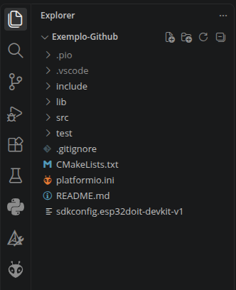
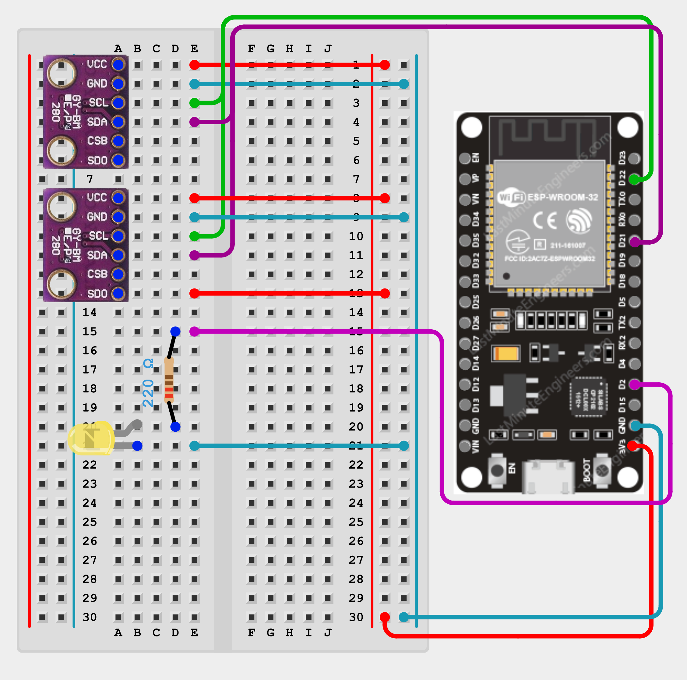

# Repositório Exemplo Antares

Esse repositório serve como exemplo de arquitetura dos projetos de eletrônica da Equipe Antares de Foguetemodelismo e também serve como um guia para contribuir com tais projetos. Representado nesse repositório está um projeto simples para um detector de altura, que utiliza um ESP32, dois barômetros BMP280/BME280, um LED e um resistor, escrito em ESPIDF (usando C).

Este README.md está dividido nas seguintes secções:

  

- [Dependências](#dependências)

- [Ambiente de Desenvolvimento](#ambiente-de-desenvolvimento)

- [Código](#código)

- [Hardware](#hardware)

- [Contribuição](#contribuição)

## Dependências

Para começar a contribuir com código nos projetos da Equipe Antares, você primeiro vai precisar:

  

- Conta do Github

- IDE da sua escolha (recomendo o VSCode ou a IDE do PlatformIO)

- Addon do PlatformIO para sua IDE

- Git

- CMakeList

- Compilador de C

Caso não tenha alguma das dependências sua primeira tarefa será instalar e configurar as faltantes. Todas estão disponíveis tanto no Windows quanto no Linux.

  

## Ambiente de Desenvolvimento

  

Agora o precisamos configurar o ambiente para começar a desenvolver o projeto. Atualmente usamos o PlatformIO para compilar e enviar o código feito aos microcontroladores, então usaremos o ambiente dele, seja IDE dele ou como addon, nos projetos.

  

Primeiramente abra o terminal, vá para um local onde deseja, e clone o projeto:

  

```bash

git  clone  https://github.com/AntaresOrg/Exemplo-Github.git

```

  

Ao rodar o comando você ira clonar o repositório, ficando com a seguinte estrutura padrão do PlatformIO:



  

Uma breve descrição de cada componente do projeto:

- Pastas com . no começo:

São pastas de arquivos locais de configuração, o .pio tem configurações locais do PlaatformIO e o .vscode, configurações do VSCode.

- include:

Pasta que tem os headers e arquivos de configuração global do projeto, como o pins.h que tem as definições dos pinos do ESP32. Nesse projeto se atente para o bmp280.h, que contém as assinaturas das funções que devem ser implementadas por você, além de uma breve explicação dos requisitos dessa repositório exemplo.

- lib:

Pasta que contem qualquer bibliotecas externas que vamos usar. Nesse projeto não temos nenhuma.

- src:

Pasta com arquivos fonte em C do projeto. É aqui que deve ser implementado toda a parte funcional do código, nesse projeto você deve trabalhar no bmp280.c, mas aqui também contém o arquivo principal e de entrada do código, o main.c.

- test:

Pasta que contém todos os arquivos de teste e validação do código. No nosso projeto também não usaremos ela.

- .gitignore:

Arquivo especial que define quais arquivos e pastas serão excluídos do versionamento do git. Por exemplo a pasta .vscode, contém apenas as configurações locais do projeto no VSCode, sendo inútil para outras pessoas, então para não versionarmos esses tipos de arquivos, os incluímos no .gitignore.

- CMakeLists.txt:

Arquivo que define o PATH da ferramenta CMakeList, para compilar e linkar arquivos C.

- platformio.ini:

Arquivo de configuração do projeto, aqui definimos qual microcontrolador (esp32doit-devkit-v1), plataforma estamos usando (ESPIDF) e outras configurações do hardware usado.

- sdkconfig.esp32doit-devkit-v1:

Arquivo auto gerado pelo PlatformIO para configurar a plataforma que estamos usando. Não alterar.

  

Agora que temos os arquivos podemos começar a codar, mas antes disso, se familiarize com as opções de compilação e flash do PlatformIO, isso pode variar de IDE para IDE, mas colocarei o exemplo do VSCode:

  


  

Onde os símbolos relevantes são dá casa até a tomada:

  

- Casa: Abre a página home do PlatformIO

- Check: Compila o projeto atual do PlatformIO

- Seta: Flash o código compilado pela porta selecionada

- Lixo: Limpa artefatos já gerados pelo PlatformIO

- Poção: Roda os testes do projeto

- Tomada: Abre o monitor serial da porta selecionada no terminal

- Terminal: Abre um terminal do PlatformIO

- Pasta: Escolhe qual projeto do Platformio está Ativo

- Tomada: Escolhe qual porta o PlatformIO está usando

  

Nós usaremos vários desses botões durante o desenvolvimento e teste do projeto, se familiarize com eles.

  

## Código

  

Agora é hora de codar o projeto, para isso deveremos implementar algumas funções já definidas em C. Primeiramente abra o arquivo: [bmp280.h](include/bmp280.h). Lá teremos a assinatura das funções que iremos implementar para o projeto além de instruções detalhadas da tarefa.

  

Após a leitura dos requerimentos do projeto, você deve agora implementar em C as funções pedidas no arquivo [bmp280.c](src/bmp280.c). Você pode usar o código do [bmp280 da aviônica do Neblina](https://github.com/AntaresOrg/Avionica-Neblina-I/blob/main/src/bmp280.cpp) como inspiração, porém se atente que este código está bagunçado e forma alguma otimizado ou bem estruturado, além de ter algumas diferenças explicitas no que foi pedido nessa tarefa, você também pode usar como inspiração o código na minha Pull Request de exemplo.

  

Você também é encorajado a checar o [main.c](src/main.c) para entender como está sendo feito a implementação do Loop Principal do projeto para detectar a altura atual e ascender o led. Além dos arquivos [pins.h](include/pins.h) e [configs.h](include/configs.h) que contém arquivos de pinagem e configuração de constantes do projeto.

  

Quando você estiver pronto para testar sua implementação, você devera primeiramente compilar seu código usando o botão de compilação do PlatformIO (você pode fazer isso via CLI também se preferir), o primeiro indicativo que o código que você fez está certo é ele compilar sem erros. Caso você consiga compilar seu código, podemos ir para a etapa de testar se ele apenas compila ou se realmente roda de maneira desejada, caso contrário leia os erros gerados pelo PlatformIO para encontrar os problemas, e os corrija.

  

## Hardware

  

Com seu código compilando, devemos agora testar ela na prática, para isso, precisaremos dos seguintes componentes:

  

- 1x ESP32

- 2x BMP280

- 1x LED

- 1x Resistor

- 1x Breadboard

  

Caso você não tenha alterado os pins do projeto no código, temos de fazer as seguintes ligações:

  



  

Com o hardware montado, conecte seu computador ao ESP32 e encontre a porta que ele se conectou. Por experiência, no Linux ela sempre é a dev/tty/USB0, no Windows você pode precisar verificar o Gerenciador de Dispositivos.

  

Agora, flashe o código compilado no ESP32 usando o PlatformIO (via botão de flash ou CLI), caso de erro de primeira tente de novo com o mesmo código, as vezes um congestionamento no porta do ESP causa o primeiro flash a falhar. Com o código compilado, leve o circuito até o treshold acima do que foi escolhido para que a LED se acenda (dica: mude o valor padrão em [configs.h](include/configs.h) para testar mais facilmente ou inverta o if de verificação de altura no [main.c](src/main.c) para checar se a LED esta acendendo). Caso você não tenha o comportamento esperado, seu código provavelmente está errado, você terá de refazer e debugar ele.

  

Com o código pronto, podemos passar para entender como contribuir com seu código via Git/Github.

  

## Contribuição
